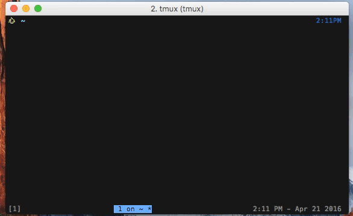

# git-reclone :rocket:

replace your local copy of a git repo with a fresh clone from your remote.

tested and works well for:

    - github
    - bitbucket
    - gitea
    - gogs

## setup

    [sudo] gem install git-reclone

This will enable the `git reclone` command automatically!

## usage

    git reclone

reclones from the first git remote. to clone a specific remote, specify some
part (or all) of the host name. for example:

    git reclone bit
    git reclone bucket
    git reclone bitbucket

will all replace the current repository with a fresh clone from bitbucket's
remote (assuming that some other host/repo name doesn't also match 'bitbucket').

The tool safely clones to a temporary directory first, so if the clone fails,
your local copy remains intact. Your current branch is automatically restored
after recloning (if it exists on the remote).

## about

sometimes i mess up git histories, with (merges or rebasing, etc), and it
becomes more of a headache to figure out how to undo what i did than to just
get a fresh clone from the remote and apply the changes i want in the right
way. i was doing this often enough that i figured it would be nice to have a
tool that just did this automatically. the tool clones to a temporary directory
first, so if something goes wrong, your local copy is safe. besides, it can be
satisfying to just start fresh from the remote - after all, what are backups
meant for?

## testing

    bundle || gem install bundler && bundle
    rake # running git-reclone's tests

